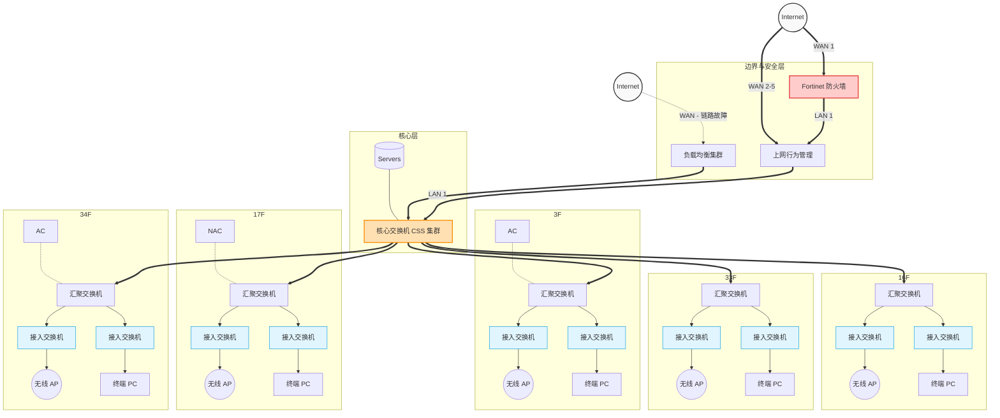

# 远程办公场景下，通过 WireGuard 代替 IPSEC 实现网络互访

### 🛠️ 实验室基础环境

#### 节点 A（Client）: Ubuntu 24.04 (Noble Numbat) / Windows 11，位于用户家中。

#### 节点 B（Sever）:  Red Hat Enterprise Linux 9.3, 位于企业内网环境。

### 🌈 网络拓扑架构

*WireGuard Server --> Core SW --> 深信服AC --> FortiGate 100F --> 出口*


### 一、WireGuard Server 基础配置

#### 1、安装EPEL仓库
```bash
# 1. 启用 EPEL 仓库
sudo dnf install epel-release -y

# 注意：如果是正宗的 RHEL 9 官方镜像，可能需要先注册或手动下载 EPEL 的 rpm 包：
# sudo dnf install https://dl.fedoraproject.org/pub/epel/epel-release-latest-9.noarch.rpm -y
分析工具: Wireshark, tcpdump, tshark, iperf3
```

#### 2、安装WireGuard工具
```bash
# 2. 安装 wireguard-tools
sudo dnf install wireguard-tools -y
```

#### 3、验证安装
```bash
# 查看 wg 命令是否可用
wg --version

# 验证内核是否成功加载了 wireguard 模块
lsmod | grep wireguard
# 如果没有输出，可以手动加载一下：sudo modprobe wireguard
```

#### 4、放行UDP 51820端口

```bash
# 永久放行 UDP 51820 端口
sudo firewall-cmd --add-port=51820/udp --permanent

# 重新加载防火墙规则使其生效
sudo firewall-cmd --reload

# 查看是否放行成功
sudo firewall-cmd --list-ports
```

### 二、WireGuard Server 开启网卡转发

#### 第一步：开启内核级 IP 转发
```bash
# 写入配置到 sysctl 配置文件中
echo "net.ipv4.ip_forward = 1" | sudo tee /etc/sysctl.d/99-wireguard.conf

# 让内核立即生效
sudo sysctl -p /etc/sysctl.d/99-wireguard.conf

# 验证是否生效（输出应为 1）
cat /proc/sys/net/ipv4/ip_forward
```
#### 第二步：配置 Firewalld 开启 NAT 伪装 (核心区别)
```bash
# 1. 确认你当前上网的主网卡属于哪个 zone（通常是 public）
sudo firewall-cmd --get-active-zones

# 2. 在默认 zone 开启 Masquerade (源地址伪装 / SNAT)
sudo firewall-cmd --add-masquerade --permanent

# 3. 别忘了放行 WireGuard 的监听端口
sudo firewall-cmd --add-port=51820/udp --permanent

# 4. 重载防火墙规则使其生效
sudo firewall-cmd --reload

# 5. 检查配置状态 (确保 masquerade: yes)
sudo firewall-cmd --list-all
```

>💡 GitHub 笔记高光时刻：在 Ubuntu 中，我们通常在 wg0.conf 的 PostUp 里写一长串 iptables 规则。但在 RHEL 9 中，我们推荐使用原生的 firewalld 来做 SNAT，这才是纯正的企业级做法。

#### 第三步：配置 RHEL 端的 wg0.conf
在 /etc/wireguard/wg0.conf 中，服务端的配置其实保持极其精简即可，不需要加那些繁琐的 PostUp 脚本了（因为 firewalld 已经接管了 NAT）。
```bash
[Interface]
PrivateKey = <RHEL_服务器的私钥>
Address = 10.0.0.1/24
ListenPort = 51820

[Peer]
# 这是一个客户端的配置示例
PublicKey = <客户端的公钥>
AllowedIPs = 10.0.0.2/32
```
配置完成后，使用 **sudo wg-quick up wg0** 启动接口，并用 **sudo systemctl enable wg-quick@wg0** 设置开机自启。

#### 第四步：客户端配置 (劫持默认路由)
要让客户端的“所有流量”都走 VPN，关键在于客户端的配置。
在你的 Windows 或 Ubuntu 客户端的 wg0.conf 中，你需要修改两个核心参数：
```bash
[Interface]
PrivateKey = <客户端私钥>
Address = 10.0.0.2/24
# 【关键 1】必须配置 DNS！既然所有流量都走隧道了，原本的本地 DNS 就失效了。
# 建议写公共 DNS (如 1.1.1.1, 8.8.8.8)，或者如果 RHEL 上有自建 DNS 就写 10.0.0.1
DNS = 1.1.1.1, 8.8.8.8
MTU = 1280

[Peer]
PublicKey = <RHEL_服务器的公钥>
Endpoint = <RHEL_的公网IP>:51820
# 【关键 2】0.0.0.0/0 代表匹配所有 IPv4 流量，统统塞进隧道！
AllowedIPs = 0.0.0.0/0
PersistentKeepalive = 25
```

#### 第五步：测试连通性并与L2TP over IPsec进行对比：


